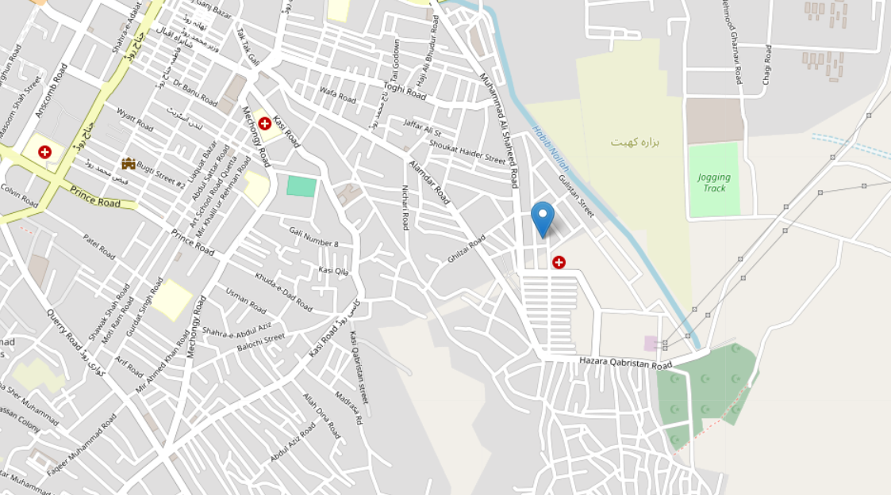

# 🌍 RealTime Tracker

A **real-time location tracker** built with **Node.js**, **Express**, **Socket.IO**, and **Leaflet** — featuring a modern UI, and smooth live updates.



---

## ✨ **Features**

✅ Live geolocation tracking of multiple users  
✅ Modern, responsive design with clean typography  
✅ Smooth fly animations as users move  
✅ Custom branding overlay  
✅ Built with open-source technologies

---

## ⚙ **Tech Stack**

- Node.js + Express
- Socket.IO (real-time communication)
- Leaflet.js (interactive maps)
- CartoDB basemaps (light & dark tiles)
- HTML, CSS (with Google Fonts)

---

## 🚀 **Getting Started**

### 1. Clone the repo

```bash
https://github.com/ahmedyar7/RealTime-Tracker.git
cd RealTime-Tracker
```

### 2. Install dependencies

```bash
npm install
```

### 3. Create `.env`

```bash
PORT=8000
```

### 4. Run the server

```bash
npm start
```

Server will start on:

```bash
http://localhost:8000
```

---

## 🌙 **Usage**

- Open the app in multiple tabs or devices.
- Each user’s location will appear on the map in real-time.

---

## 📂 **Project Structure**

```plaintext
.
├── public/
│   ├── css/
│   │   └── styles.css
│   ├── js/
│   │   └── script.js
│   └── images/
│       └── custom-marker.png
├── views/
│   └── index.ejs
├── app.js
├── package.json
└── README.md
```

---

## 🧑‍💻 **Contributing**

Contributions are what make the open source community such an amazing place to learn, inspire, and create. Any contributions you make are greatly appreciated.

- Fork the Project
- Create your Feature Branch (`git checkout -b feature/AmazingFeature`)
- Commit your Changes (`git commit -m 'Add some AmazingFeature'`)
- Push to the Branch (`git push origin feature/AmazingFeature`)
- Open a Pull Request

---

## 📄 **License**

This project is open-source under the [MIT License](LICENSE).
